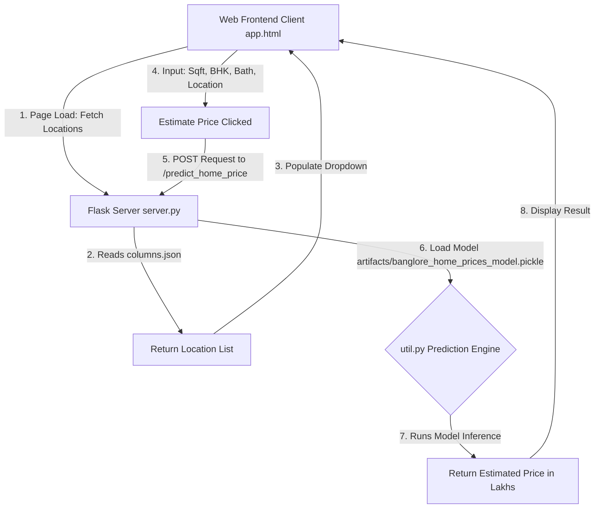

# 🏡 Bangalore House Price Prediction Project

### 👤 Developer Info
* **Name:** Kumar Shantam Gupta
* **Registration Number:** 23BAI11113

---

This project is a **Full-Stack Machine Learning Web Application** that predicts residential property prices in Bangalore (Bengaluru), India, based on area square footage, number of bedrooms (BHK), number of bathrooms, and location.

The application features a modern, clean HTML/CSS/JS frontend, a Python Flask REST API backend, and a trained Linear Regression model.

---

## 🗺️ Project Architecture & Data Flow



---

## 📁 Project Directory Structure

The project is structured into three main layers: **Model (Data Science & ML)**, **Server (Flask API)**, and **Client (UI Frontend)**.

```
house price prediction/
│
├── BHP/
│   ├── model/                      # Machine Learning & Model Development
│   │   ├── banglore_home_prices_model.pickle  # Trained Scikit-Learn Model
│   │   ├── columns.json            # Data structure of trained features/columns
│   │   └── price.py                # Data Cleaning, Outlier Removal & Training script
│   │
│   ├── Server/                     # Flask Backend API
│   │   ├── artifacts/              # Copy of model artifacts for Flask serving
│   │   │   ├── banglore_home_prices_model.pickle
│   │   │   └── columns.json
│   │   ├── server.py               # Flask application definition & endpoints
│   │   └── util.py                 # Utility module to load artifacts & run predictions
│   │
│   └── client/                     # Frontend Webpage
│       ├── app.html                # Main UI Layout
│       ├── app.css                 # UI Styling
│       └── app.js                  # API caller & DOM controller using jQuery
│
├── README.md                       # Documentation (This file)
└── tempCodeRunnerFile.py           # Temporary scratch file
```

---

## 🔬 Detailed Machine Learning Pipeline (`price.py`)

The heart of the project is the data science pipeline implemented in [price.py](file:///d:/python/project/house%20price%20pridiction/BHP/model/price.py). It processes the raw Bengaluru House Price dataset through the following steps:

### 1. Data Cleaning
* **Dropping Unused Features**: Removed columns like `area_type`, `society`, `balcony`, and `availability` since they had high missing values or minimal impact on pricing.
* **Handling Missing Data**: Dropped rows with null values.
* **Feature Parsing**:
  * **Size to BHK**: Extracted the number of bedrooms as an integer from strings like `"2 BHK"` or `"4 Bedroom"`.
  * **Total Square Feet Clean**: Converted values like `"2100 - 2850"` to their average (`2475.0`). Rows with non-standard strings (e.g., `"34.46sq. Meter"`) were discarded.

### 2. Feature Engineering & Dimensionality Reduction
* **Price Per Sqft**: Created `price_per_sqft = (price * 100,000) / total_sqft` (since price is in Lakhs) to assist in outlier detection.
* **Location Consolidation**: The dataset had over 1,300 unique locations, many of which only had 1 or 2 properties. Any location with **10 or fewer properties** was categorized as `"other"`. This reduced unique locations to 242, preventing a massive explosion of columns during one-hot encoding.

### 3. Outlier Removal (Domain-Specific & Statistical)
Real estate datasets contain noise and data entry errors. The following filters were applied to clean the dataset:
* **Sqft per BHK Outlier**: Properties where `total_sqft / BHK < 300` were removed (e.g., a 1,000 sqft house with 8 bedrooms is unrealistic).
* **Price Per Sqft Outlier**: Grouped data by location and removed properties whose `price_per_sqft` fell outside 1 standard deviation ($\mu \pm \sigma$) from the location's mean.
* **BHK Price Outlier**: Removed properties where, for the same location, a higher-BHK home cost less than the mean price of a lower-BHK home of similar square footage (e.g., a 3 BHK home costing less than a 2 BHK home in the same area).
* **Bathroom Outlier**: Removed properties where `bathrooms > BHK + 2` (e.g., a 2 BHK home with 5 bathrooms).

### 4. Model Training & Selection
* **One-Hot Encoding**: Converted the categorical `location` column into dummy columns using `pd.get_dummies()`.
* **Model Comparison**: Used `GridSearchCV` with a 5-fold `ShuffleSplit` cross-validation to find the best-performing algorithm among:
  1. **Linear Regression** (Score: **~84.7%**)
  2. **Lasso Regression** (Score: **~68.7%**)
  3. **Decision Tree Regressor** (Score: **~71.4%**)
* **Serialization**: The best-performing **Linear Regression** model was trained and exported using `pickle` alongside feature column indices.

---

## ⚡ Backend API Endpoints (`server.py`)

The backend is built using **Flask**. It provides two primary endpoints:

### 1. `GET /get_location_names`
* **Purpose**: Returns the list of all valid locations the model was trained on.
* **Response Format**:
  ```json
  {
      "locations": ["1st phase jp nagar", "electronic city", "whitefield", ...]
  }
  ```

### 2. `POST /predict_home_price`
* **Purpose**: Receives property details and returns the estimated price.
* **Request Parameters (Form Data)**:
  * `total_sqft` (float): Total area in square feet.
  * `bhk` (int): Number of bedrooms.
  * `bath` (int): Number of bathrooms.
  * `location` (string): Target location.
* **Response Format**:
  ```json
  {
      "estimated_price": 62.53
  }
  ```
  *(Note: The price is returned in **Lakhs** (e.g., 62.53 Lakhs = ₹6,253,000).*

---

## 🎨 UI Frontend (`app.html` & `app.js`)

* **UI Layout**: Built with a clean background, custom typography, form inputs for square footage, and customized radio switches for BHK and Bathroom counts.
* **Dynamic Location Dropdown**: On page load, `app.js` issues a `GET` request to the Flask API `/get_location_names` to fetch the location array and populate the dropdown dynamically.
* **Instant Calculation**: Clicking "Estimate Price" issues a `POST` request to `/predict_home_price` with the parameters and displays the estimated price in Lakhs inside the card.

---

## 🚀 Setup & Execution Guide

### Prerequisite
Make sure you have **Python 3.8+** installed on your system.

### 1. Set Up the Server Backend
1. Open your terminal and navigate to the Server directory:
   ```bash
   cd BHP/Server
   ```
2. Create a virtual environment:
   ```bash
   python -m venv .venv
   ```
3. Activate the virtual environment:
   * **Windows (PowerShell)**: `.venv\Scripts\Activate.ps1`
   * **macOS/Linux**: `source .venv/bin/activate`
4. Install the required Python packages:
   ```bash
   pip install flask numpy pandas scikit-learn
   ```
5. Run the Flask application:
   ```bash
   python server.py
   ```
   *The server will start running on `http://127.0.0.1:5000/`.*

### 2. Run the Frontend Client
1. Double-click [app.html](file:///d:/python/project/house%20price%20pridiction/BHP/client/app.html) to open it in any web browser, or serve it using a local VS Code live server extension.
2. Select a location, enter square footage, BHK, Bathrooms, and click **Estimate Price** to get property values immediately!

---

## 🖥️ Running and Testing via VS Code & Postman

### 1. Running the Project in VS Code (VS)
To run the project directly through Visual Studio Code:
1. **Open Workspace**: Open the `house price prediction` folder in VS Code.
2. **Select Interpreter**: Open `BHP/Server/server.py`. Press `Ctrl + Shift + P` (or `Cmd + Shift + P` on macOS), search for `Python: Select Interpreter`, and select your virtual environment (e.g., `.venv` or `.venvflask1`).
3. **Start the API Server**:
   * Right-click inside `server.py` and select **Run Python File in Terminal**, or
   * Click the **Play** button in the top-right corner of the editor.
   * *This starts the Flask server at `http://127.0.0.1:5000/`.*
4. **Start the Client UI**:
   * Open `BHP/client/app.html`.
   * If you have the **Live Server** extension installed, right-click the file and select **Open with Live Server**.
   * Otherwise, simply right-click `app.html` and choose **Copy Path**, then paste it into your browser.

---

### 2. Testing API Endpoints via Postman
You can test the Flask API routes using **Postman** to ensure predictions are working correctly without the frontend:

#### A. Fetch Location List (`GET`)
* **Request Type**: `GET`
* **Request URL**: `http://127.0.0.1:5000/get_location_names`
* **Headers**: None required.
* **Steps**: Click **Send**.
* **Expected Output**: A list of all 240+ locations in Bangalore:
  ```json
  {
      "locations": ["1st phase jp nagar", "electronic city", "whitefield", ...]
  }
  ```

#### B. Get Price Estimate (`POST`)
* **Request Type**: `POST`
* **Request URL**: `http://127.0.0.1:5000/predict_home_price`
* **Body Format**: `x-www-form-urlencoded` or `form-data`
* **Key-Value Parameters**:
  * `total_sqft` : `1000`
  * `bhk` : `2`
  * `bath` : `2`
  * `location` : `1st phase jp nagar` *(case-insensitive string matching one of the location names)*
* **Steps**: 
  1. Go to the **Body** tab in Postman.
  2. Select the **x-www-form-urlencoded** (or **form-data**) radio button.
  3. Add the keys and values as shown above.
  4. Click **Send**.
* **Expected Output**:
  ```json
  {
      "estimated_price": 62.53
  }
  ```
  *(Note: The result is in Lakhs, representing ₹62.53 Lakhs or ₹6,253,000).*

---

## 🎓 Interview & Presentation Cheat Sheet

Use these quick Q&As to explain the project during viva, presentation, or technical interviews:

### 1. How do you describe the project in 30 seconds?
> **Answer**: "I built a full-stack Bangalore House Price Prediction application. The client is a web page built with HTML, CSS, and jQuery. It sends user inputs (square footage, BHK, bathrooms, and location) via a POST request to a Python Flask API server. The Flask server runs utility code that loads a Scikit-Learn Linear Regression model from a serialized pickle file, runs inference on the inputs, and returns the estimated property price in Lakhs to display on the UI."

### 2. What was the most challenging part of this project?
> **Answer**: "Data cleaning and outlier removal. Real estate datasets are notoriously noisy. For instance, some rows had 8 bedrooms in just 600 sqft, which is an outlier. Others had prices that were far too high or low compared to the location's average. I wrote specialized Python filters to remove sqft-per-BHK anomalies, price-per-sqft statistical outliers using mean and standard deviation, and cases where lower BHKs cost more than higher BHKs in the same area. This drastically improved model performance."

### 3. Why did you use Linear Regression instead of other algorithms?
> **Answer**: "I used `GridSearchCV` to run hyperparameter tuning across multiple models, specifically comparing Linear Regression, Lasso, and Decision Tree Regressor. Linear Regression gave the highest cross-validation score of approximately **84.7%**, while Lasso was around **68%** and Decision Tree was around **71%**. Therefore, Linear Regression was chosen as the production model."

### 4. How did you handle the categorical 'location' column?
> **Answer**: "Machine learning models only understand numerical data, so the `location` column had to be converted. Since there were initially over 1,300 locations, one-hot encoding would have created 1,300+ columns (the curse of dimensionality). To solve this, I categorized any location with 10 or fewer properties as `'other'`. This consolidated the list to 242 unique locations. I then used Pandas `get_dummies()` to perform one-hot encoding, dropping the `'other'` column to avoid the dummy variable trap."

### 5. What are the files columns.json and pickle doing?
> **Answer**: 
> * **`banglore_home_prices_model.pickle`**: Contains the saved mathematical weights/parameters of our trained Linear Regression model. We deserialize (load) this file in Flask so we don't have to retrain the model from scratch every time the server starts.
> * **`columns.json`**: Saves the exact order and names of the feature columns of the training dataset. We need this because when a user submits inputs in Flask, we must construct a NumPy array structure matching the exact format of the features the model was trained on.
